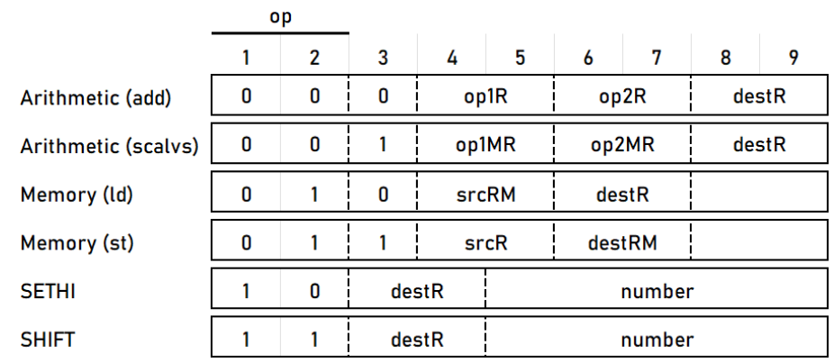

# Custom 9-bit architecture CPU with vector scalar multiplication accelerator.

## How to run

The following CPU is implemented with logisim-evolution (https://github.com/logisim-evolution/logisim-evolution). Open 9-bitProcessor.circ file with the corresponding program to run simulation.
Sample programs from ./logisim-evolution/assembly-programs/ could be loaded into processor's memory. 

## Instruction Set Architecture

### Arithmetic
An arithmetic instruction starts with bits 00. After that, there is one bit specifying whether we want to add (bit 0) or call the vector scalar multiplication accelerator (bit 1). After this bit, there are two bits for the register of the first operand. The next two bits are for the register of the second operand. The last two bits show what will be the destination register. 

### Memory
Instructions regarding memory start with bits 01. The next bit shows whether the instruction is used to load (bit 0) or store (bit 1). Bits 4 and 5 are used to show the source register, bits 6 and 7 are used to show the destination register.

### SETHI
The SETHI instruction stores user-entered 5-bit numbers in a designated register, bits 3-4 set the destination register and bits 5-9 for the number to be stored. The stored number is written to the first 5 most significant bits of the 8-bit register (00000001 + 00101 => 00101001). The instruction was designed this way to allow flexibility for user-entered numbers, which can be shifted later with the SHIFT instruction, enabling users to store any 8-bit number with only 5 bits.

### SHIFT
SHIFT instruction performs a logical shift to the left on the content of specified register. It starts with bits 11. Bits 3-4 specifies the register which contains the number to be shifted and bits 5-9 represent a number of shifting positions.

## Resources

### Registers

%r0 - zero register (normally used for accessing first memory cell); \
[%r1, %r3] - general purpose registers; \ 
%temp0 - used for storing temporary values (shift operation, stores the number of bits to be shifted); \ 
%pc - program counter; \ 
%ir - instruction register; \

*All registers are 8 bits long except %ir, which is 9 bits long.  

### ALU

#### Operations: 

1. "+" - 8-bit unsigned addition;
2. "->" - logical right shift (bitwise);
3. "+=1" - increment 8-bit number;

### Memory

#### Type

32 x 9 RAM

## Control Path (FSM)

## Sample Programs

